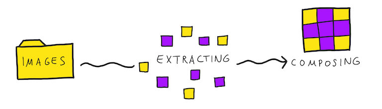
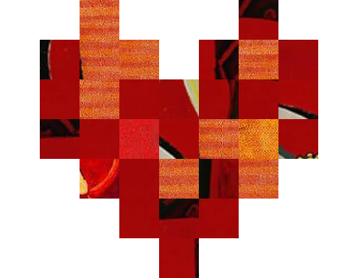

# img2pimg

`img2pimg` looks for squares with specific size in images, that have a overall given color. In a second step the algorithm uses all gatheres squares to create a new image by a given template, where each pixel is represented by one square.

## TODO

- [ ] Optimize SOURCE_DIR validation (maybe just check random_sqaure on valid size while loading it, instead of all images in the SOURCE_DIR before creating the image)
- [ ] Replace euclidean distance formula for similarity check with L*a*b method
- [ ] opt-in full color squares for example (white or black as background color)
- [ ] Not using duplicate sqaure in one image
